# ai-startup-website

## This project showcases my practical experience with GitHub and Git in implementing collaborative project management using these technologies.

Create an empty file `index.html` and add content to it.

- Check the status to observe that it has not been staged.

- Stage the changes

- Commit changes

- Push main branch to Github

## Simulating Tom and Jerry's Work

# TOM'S WORK

- Check current branch

- Create a new branch for Tom's work

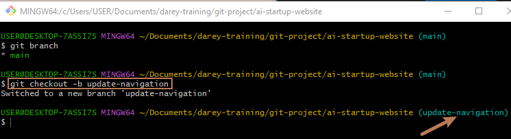

- Open the index.html and add Tom's update

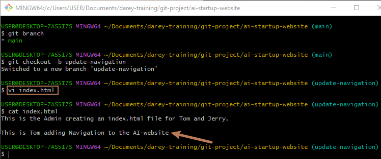

- Check changes

- Stage Tom's changes

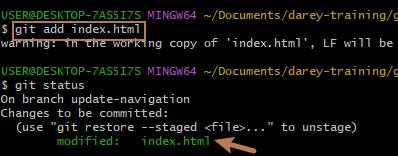

Commit Tom's Changes

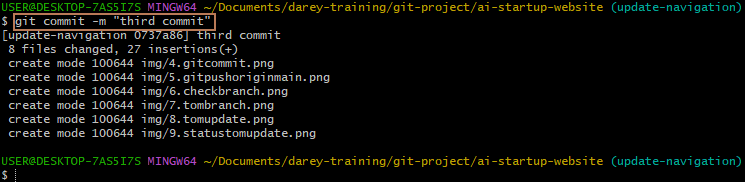

Push Tom's branch to Github

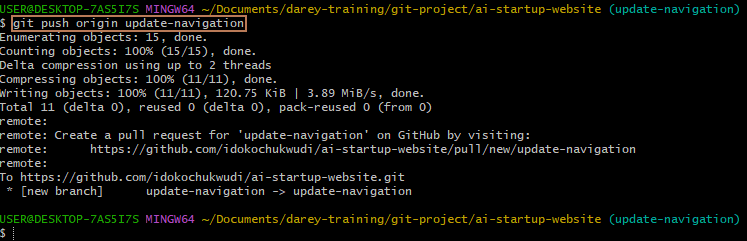

### The last command sends Tom's commit from my local branch on my laptop to GitHub (Remote Repository)

# JERRY'S WORK

- Switch back to the main branch

- Pull the Latest Changes

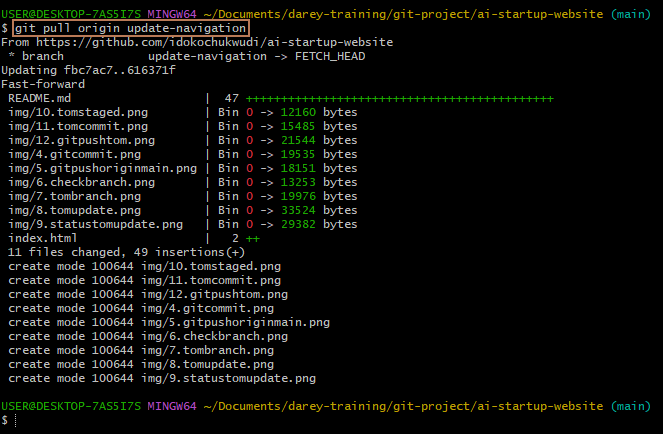

- Create a New Branch for Jerry's Work

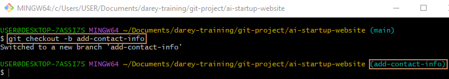

- Open index.html and Add Contact Information

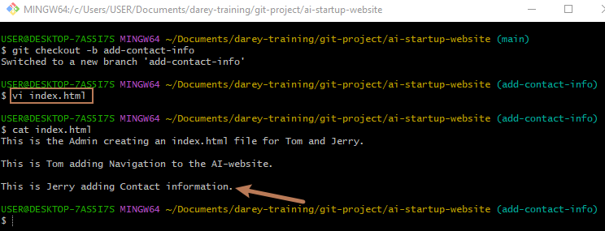

- Stage Jerry's Changes

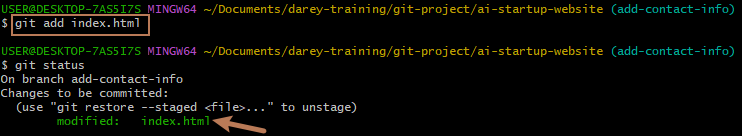

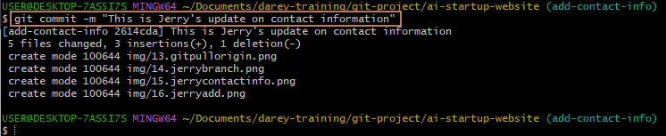

- Push Jerry's Branch to GitHub

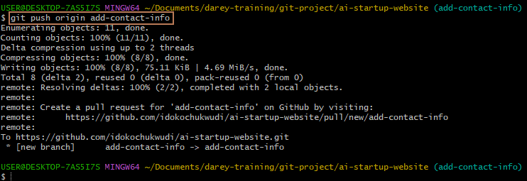

