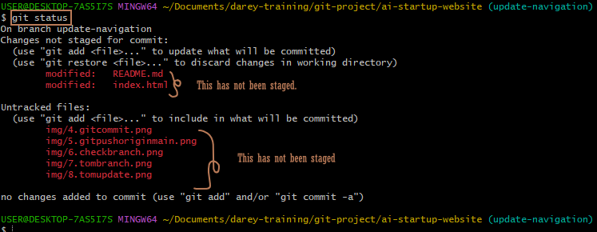

# ai-startup-website

## This project showcases my practical experience with GitHub and Git in implementing collaborative project management using these technologies.

Create an empty file `index.html` and add content to it.

- Check the status to observe that it has not been staged.

- Stage the changes

- Commit changes

- Push main branch to Github

## Simulating Tom and Jerry's Work

- Check current branch

- Create a new branch for Tom's work

- Open the index.html and add Tom's update

- Check changes

- Stage Tom's changes

Commit Tom's Changes

